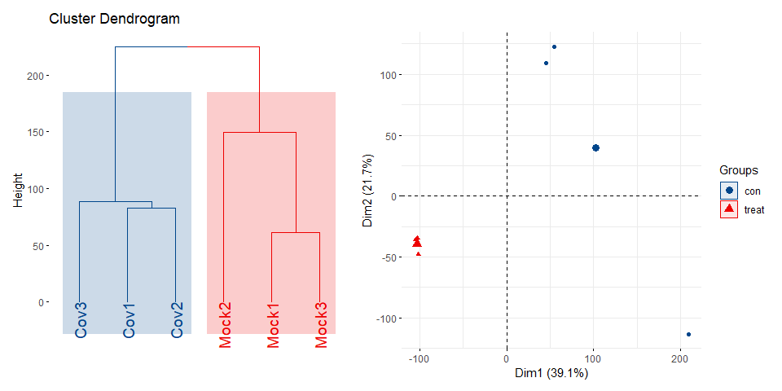
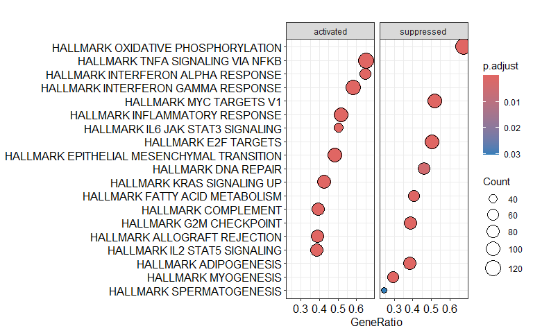

<!-- README.md is generated from README.Rmd. Please edit that file -->
<!-- badges: start -->

[](https://github.com/HUI950319/BulkS4/actions/workflows/R-CMD-check.yaml)
[](https://lifecycle.r-lib.org/articles/stages.html#experimental)
[](https://opensource.org/licenses/MIT)
[](https://github.com/HUI950319/BulkS4/actions/workflows/pkgdown.yaml)
<!-- badges: end -->

# BulkS4: S4 Classes for Bulk RNA-seq Data Analysis

**BulkS4** is a comprehensive R package that provides S4 classes and
methods for bulk RNA-seq data analysis. The package offers a unified
framework for storing, analyzing, and visualizing bulk RNA-seq data with
integrated support for:

- 🧬 **Differential Expression Analysis** using DESeq2, edgeR, and
  limma-voom
- 📊 **Gene Set Enrichment Analysis (GSEA)**
- 🎯 **Gene Set Variation Analysis (GSVA)**
- 📈 **Rich Visualization Tools** for publication-ready plots
- 🗂️ **Integrated Data Management** with S4 classes

Find out more at <https://hui950319.github.io/BulkS4/>.

## ✨ Key Features

- **BulkRNAseq S4 Class**: Unified data structure for storing raw
  counts, normalized data, sample metadata, and analysis results
- **Data Validation**: Built-in data consistency checks and validation
  mechanisms
- **Flexible Constructor**: Support for creating objects from matrices
  or preprocessed lists
- **Rich Visualization**: Complete set of plotting functions for
  expression data, heatmaps, volcano plots, and more
- **MSigDB Integration**: Automatic loading of MSigDB gene sets
  (Hallmark, KEGG, Reactome, GO)
- **Multiple DE Methods**: Integrated support for DESeq2, edgeR, and
  limma-voom with method comparison
- **Gene Set Analysis**: GSEA and GSVA analysis capabilities with
  multiple gene set collections

## 📦 Installation

``` r
# Install from GitHub (recommended)
if (!require("devtools")) install.packages("devtools")
devtools::install_github("HUI950319/BulkS4")

# Load the package
library(BulkS4)
```

## 🚀 Quick Start

### Load Example Data

BulkS4 comes with example datasets that you can use to get started:

``` r
library(BulkS4)

# Load example datasets included in the package
data(counts)      # Example RNA-seq count matrix (36888 genes × 6 samples)
data(metadata)    # Example sample metadata
data(geneSet_msig) # MSigDB gene sets

# Examine the example data
head(counts)
#>          Cov1 Cov2 Cov3 Mock1 Mock2 Mock3
#> TSPAN6   1270 1013  848  4571  5500  4844
#> TNMD      121  125   49  3220  6435  2977
#> DPM1     1023 1045  674  2404  4794  1819
#> SCYL3    1049  713  692   854   356  1015
#> C1orf112  211  158   90   576   195   477
#> FGR         9    8    2    10     5     0
head(metadata)
#>       sample group
#> Cov1    Cov1 treat
#> Cov2    Cov2 treat
#> Cov3    Cov3 treat
#> Mock1  Mock1   con
#> Mock2  Mock2   con
#> Mock3  Mock3   con
```

### Create BulkRNAseq Object

``` r
# Create BulkRNAseq object from example data
bulk_obj <- BulkRNAseq(counts, metadata)

# View object summary
bulk_obj                     
#> 
#>  ====== BulkRNAseq Object ====== 
#> 
#> Genes:          36888
#> Samples:        6
#> Metadata vars:  sample, group
#> 
#>  ------ Analysis Results ------ 
#> 
#> Diff analyses:  0: None
#> Gene sets:      25: C1, C2_CGP, C2_CP, C2_CP:BIOCARTA, C2_CP:KEGG_LEGACY, C2_CP:KEGG_MEDICUS, C2_CP:PID, C2_CP:REACTOME, C2_CP:WIKIPATHWAYS, C3_MIR:MIRDB, C3_MIR:MIR_LEGACY, C3_TFT:GTRD, C3_TFT:TFT_LEGACY, C4_3CA, C4_CGN, C4_CM, C5_GO:BP, C5_GO:CC, C5_GO:MF, C5_HPO, C6, C7_IMMUNESIGDB, C7_VAX, C8, H
#> GSEA results:   0: None
#> GSVA results:   0: None
#> 
#>  --------------------------------------------------
```

## 🔬 Differential Expression Analysis

### Run Differential Analysis

``` r
# Run differential expression analysis using DESeq2--add normalized data and diff results
bulk_obj <- runDiffAnalysis(bulk_obj, method = "DESeq2")
# View the updated object
bulk_obj    # View the updated object 
# Get differential expression results
diff_results <- getDiffResults(bulk_obj)
head(diff_results[[1]])
```

## 📊 Visualization Examples

BulkS4 provides comprehensive visualization functions for RNA-seq data
analysis:

### Gene Expression Bar/Box Plots

``` r
# Single gene expression
bar(bulk_obj, genes = "CD36", group = "group")
```


``` r
# Multiple genes expression
bar(bulk_obj, genes = c("CD36", "GAPDH", "ACTB"), group = "group")
```


### Heatmaps

``` r

# Heatmap of specific genes
selected_genes <-c("TSPAN6", "TNMD", "DPM1", "SCYL3", "C1orf112", "FGR", "CFH")
hmap(bulk_obj, genes = selected_genes)
```


``` r

# Heatmap of top 20 DEGs
bulk_obj <- runDiffAnalysis(bulk_obj, method = "DESeq2")
hmap(bulk_obj, genes = 10)
```


### PCA and Hierarchical Clustering

``` r
# PCA and hierarchical clustering combined plot
# Note: This requires additional packages (factoextra, tinyarray, ggsci, patchwork)
pca_hc(bulk_obj)
```



### Volcano Plot

``` r
# Create volcano plot for differential expression results
bulk_obj <- runDiffAnalysis(bulk_obj, method = "DESeq2")
volcano(bulk_obj, data = "DESeq2_treat_vs_con")
```


### MA Plot

``` r
# Create MA plot
bulk_obj <- runDiffAnalysis(bulk_obj, method = "DESeq2")
MA(bulk_obj, data = "DESeq2_treat_vs_con")
```


## 🎯 Gene Set Analysis

### Gene Set Enrichment Analysis (GSEA)

``` r
# Run GSEA analysis-- use genesets from MSigDB
bulk_obj <- gsea(bulk_obj, geneSet_name = "H" )

# # Run GSEA analysis with common used genesets
# bulk_obj <- gsea(bulk_obj, geneSet_name = c("H", "C2_CP:KEGG_LEGACY", "C5_GO:BP", "C5_GO:CC", "C5_GO:MF") )

# View bulk_obj--gsea results add to gsea slot
bulk_obj
#> 
#>  ====== BulkRNAseq Object ====== 
#> 
#> Genes:          36888
#> Samples:        6
#> Metadata vars:  sample, group
#> 
#>  ------ Analysis Results ------ 
#> 
#> Diff analyses:  1: DESeq2_treat_vs_con
#> Gene sets:      25: C1, C2_CGP, C2_CP, C2_CP:BIOCARTA, C2_CP:KEGG_LEGACY, C2_CP:KEGG_MEDICUS, C2_CP:PID, C2_CP:REACTOME, C2_CP:WIKIPATHWAYS, C3_MIR:MIRDB, C3_MIR:MIR_LEGACY, C3_TFT:GTRD, C3_TFT:TFT_LEGACY, C4_3CA, C4_CGN, C4_CM, C5_GO:BP, C5_GO:CC, C5_GO:MF, C5_HPO, C6, C7_IMMUNESIGDB, C7_VAX, C8, H
#> GSEA results:   1: H
#> GSVA results:   0: None
#> 
#>  --------------------------------------------------
# head(bulk_obj@gsea$H)

# Visualize GSEA results
clusterProfiler::dotplot(bulk_obj@gsea$H, split = ".sign", label_format = 60) + ggplot2::facet_grid(~.sign)
```



### Gene Set Variation Analysis (GSVA)

``` r
# Run GSVA analysis -- add gsva results and diff results of gsva results
bulk_obj <- gsva(bulk_obj, geneSet_name = "H")

# # Run GSVA analysis with common used genesets
# bulk_obj <- gsva(bulk_obj, geneSet_name = c("H", "C2_CP:KEGG_LEGACY", "C5_GO:BP", "C5_GO:CC", "C5_GO:MF") )

# View bulk_obj--gsva results add to gsva slot
bulk_obj
#> 
#>  ====== BulkRNAseq Object ====== 
#> 
#> Genes:          36888
#> Samples:        6
#> Metadata vars:  sample, group
#> 
#>  ------ Analysis Results ------ 
#> 
#> Diff analyses:  2: DESeq2_treat_vs_con, H
#> Gene sets:      25: C1, C2_CGP, C2_CP, C2_CP:BIOCARTA, C2_CP:KEGG_LEGACY, C2_CP:KEGG_MEDICUS, C2_CP:PID, C2_CP:REACTOME, C2_CP:WIKIPATHWAYS, C3_MIR:MIRDB, C3_MIR:MIR_LEGACY, C3_TFT:GTRD, C3_TFT:TFT_LEGACY, C4_3CA, C4_CGN, C4_CM, C5_GO:BP, C5_GO:CC, C5_GO:MF, C5_HPO, C6, C7_IMMUNESIGDB, C7_VAX, C8, H
#> GSEA results:   1: H
#> GSVA results:   1: H
#> 
#>  --------------------------------------------------
# head(bulk_obj@gsva$H)

# Visualize GSVA results
# Bar plot
bar(bulk_obj, genes = "HALLMARK_INFLAMMATORY_RESPONSE", data = "H")
```


``` r

# Heatmap
hmap(bulk_obj, data = "H", genes = 20)
```


``` r

# Volcano plot
volcano(bulk_obj, data = "H")
```


``` r

# MA plot
MA(bulk_obj, data = "H")
```


## 📚 Documentation

For detailed tutorials and examples, please visit our [documentation
website](https://hui950319.github.io/BulkS4/):

- [Getting Started
  Guide](https://hui950319.github.io/BulkS4/articles/getting-started.html)
- [Differential Expression
  Analysis](https://hui950319.github.io/BulkS4/articles/differential-analysis.html)
- [Visualization
  Tutorial](https://hui950319.github.io/BulkS4/articles/visualization.html)
- [Function
  Reference](https://hui950319.github.io/BulkS4/reference/index.html)

## 🤝 Contributing

We welcome contributions! Please see our [Contributing
Guidelines](https://github.com/HUI950319/BulkS4/blob/master/.github/CONTRIBUTING.md)
for details.

## 📄 License

This project is licensed under the MIT License - see the
[LICENSE](LICENSE) file for details.

## 📞 Contact

- **Author**: Hui Ouyang
- **Email**: \[<ouyanghui950913@gmail.com>\]
- **GitHub**: [@HUI950319](https://github.com/HUI950319)
- **Issues**: [GitHub
  Issues](https://github.com/HUI950319/BulkS4/issues)

## 📖 Citation

If you use BulkS4 in your research, please cite:

    Ouyang, H. (2025). BulkS4: S4 Classes for Bulk RNA-seq Data Analysis. 
    R package version 0.1.1. https://github.com/HUI950319/BulkS4
